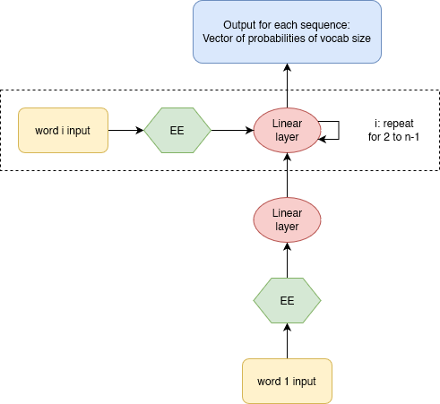
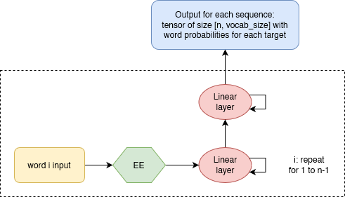

## 12 - A LANGUAGE MODEL FROM SCRATCH

### Basic recurrent neural network

One of the simplest approaches to a language model is to build a neural network that predicts each word based on a number `n` of previous words. This model takes `n` inputs and returns a prediction of the probability of each possible next word in the vocab. The loss is simply the 1 - the predicted probability for the right word in the vocabulary.

As an overview of the corresponding architecture, we would have:
* The embedding layer, which would transform each word to a one-hot encode and then to a numeric vector.
* The linear (hidden) layer, which creates the activations that are fed from each word to the next. The traditional activation function is the RELU.
* The linear (output) layer, which predicts the `n+1` word (the target).



A neural network that is defined using a loop like this is called a recurrent neural network (RNN). It is important to realize that an RNN is not a complicated new architecture, but simply a refactoring of a multilayer neural network using a `for` loop.

**PyTorch code:**

```python

# Language model using a simple RNN with a single hidden layer for each word
class LMModel(Module):

	"""
	vocab_sz: Number of unique words in the data
	seq_len:  n, the number of words considered to predict the n+1 word (target)
	n_hidden: number of hidden dimensions in the embedding and in the hidden
			layers. We are considering a constant activation architecture (i.e.,
			vocab_sz -> n_hidden -> n_hidden -> vocab_sz)
	"""
	def __init___(self, vocab_sz, seq_len, n_hidden):
		self.i_h = nn.Embedding(vocab_sz, n_hidden)	# input-hidden
		self.h_h = nn.Linear(n_hidden, n_hidden) 	# hidden-hidden
		self.h_o = nn.Linear(n_hidden, vocab_sz) 	# hidden-output
		self.sl = seq_len
		
	def forward(self, x):
		h = 0 # automatic broadcasting to the appropriate size
		for i in range(self.sl):
			h = h + self.i_h(x[:,i])
			h = F.relu(self.h_h(h))
		return self.h_o(h)
```

### Improving the RNN

#### Maintaining the state of an RNN

Since we initialize the model's hidden state to zero for each new sample (i.e., batch), we are throwing away all the information we have about the sentences we have seen so far, which means that our model does not  actually know where we are up to in the overall word sequence. This is easaily fixed by moving the initialization of the hidden state to `__init__`.

However, this fix will create its own subtle, but important, problem. It effectively makes our neural network as deep as the entire number of words in our document. For instance, if there were 10000 words, we would be creating a 10000-layer neural network. This can be easily understood if we consider the unrolled representation of the RNN.


The obvious problem of a 10000-layer  neural network is the computational cost of calculating derivatives all the way back to the first layer. In addition, it would be so memory-intensive that we could not store even a single mini-batch in the GPU.

The solution to this problem is to not backpropagate (backward pass) the derivatives through the entire implicit neural network. Instead, we will keep just the last `n` layers of gradients. The resulting model will have the same activations (forward pass) whatever sequence length `n` we pick, because the hidden state will remember the last activation from the previous batch. The only thing that will be different is the gradients computed at each step: they will be calculated on only sequence length words in the past, instead of the whole stream. This approach is called ** truncated backpropagation through time (BPTT)** [Jaeger, 2002].

One of the consequences of this **approximation** is that the model focuses primarily on short-term influence rather than long-term consequences. This is actually desirable, since it biases the estimate towards simpler and more stable models.

In PyTorch, we implement this approach through the `detach` method.

**PyTorch code:**

```python

class LMModel_state(Module):

	def __init___(self, vocab_sz, seq_len, n_hidden):
		self.i_h = nn.Embedding(vocab_sz, n_hidden)	# input-hidden
		self.h_h = nn.Linear(n_hidden, n_hidden) 	# hidden-hidden
		self.h_o = nn.Linear(n_hidden, vocab_sz) 	# hidden-output
		self.sl = seq_len
		self.h = 0 # automatic broadcasting to the appropriate size
		
	def forward(self, x):
		for i in range(self.sl):
			h = h + self.i_h(x[:,i])
			h = F.relu(self.h_h(h))
		out = self.h_o(self.h)
		self.h = self.h.detach() # truncate backpropagation through time
		return out
```

To use `LMModel_state`, we need to make sure the samples are going to be seen in a certain order so we can properly exploit the maintained state. This way, if the first sequence of the first batch is `dset[0]`, the second batch should have `dset[1]` as the first sequence, so that the model sees the text flowing. This can be easily understand if we think of it in matrix form, since a forward call is make for each batch and the operations are done "simultaneously" on the whole batch.

FastAI implicitly does this for us when using `LMDataLoader`.

#### Creating more signal for our RNN

Another problem with `LMModel` is that we predict only on output word for each `n` input words. As a result, the amount of "signal" that we are feeding back to update the weights is not as large as it could be. It would be better if we predicted the next word after every single word, rather than every `n` words.




In order to do this, each sequence could have both a number `n` of input words and a number `n` of target words. The second list will be the same as the first, but offset by one element (the first of the input list and the last of the target list). Easy to see with an example:

```python

[L(vocab[o] for o in s) for s in seqs[0]]

>>> [(#6) ['one','.','two','.','three','.'],
	 (#6) ['.','two','.','three','.','four']]
```

Now, we need to modify our model so that it ouputs a prediction after every word, rather than just at the end of a n-word sequence:

```python

class LMModel_state_signal(Module):

    def __init__(self, vocab_sz, seq_len, n_hidden):
		self.i_h = nn.Embedding(vocab_sz, n_hidden)	# input-hidden
		self.h_h = nn.Linear(n_hidden, n_hidden) 	# hidden-hidden
		self.h_o = nn.Linear(n_hidden, vocab_sz) 	# hidden-output
		self.sl = seq_len
        self.h = 0 # automatic broadcasting to the appropriate size
        
    def forward(self, x):
        outs = []
        for i in range(self.sl):
            self.h = self.h + self.i_h(x[:,i])
            self.h = F.relu(self.h_h(self.h))
            outs.append(self.h_o(self.h))
        self.h = self.h.detach() # truncate backpropagation through time
        return torch.stack(outs, dim=1)
    
    def reset(self): self.h = 0
```

By predicting multiple words per sequence, the shape of the output matrix will change to `[batch_sz, seq_len, vocab_sz]`. However our targets are of shape `[batch_sz * seq_len, vocab_sz]`, so we need to flatten those before using them with our cross-entropy loss function. For that, we use `torch.view`:

```python
def loss_func(inp, targ):
    return F.cross_entropy(inp.view(-1, len(vocab)), targ.view(-1))
```

* The resulting `input` view has a number of columns equal to the vocabulary size and a number rows equal to `batch_sz * seq_len`

* The resulting `targ` has a single column (the index in the vocabulary of the target word) and a number of rows equal to `batch_sz * seq_len` (i.e., a vector)

**Note:** Remember that view only changes the form of the tensor, not its data, 
* `view(-1)` transforms a tensor into a 1-dim vector.
* `view(-1, len(vocab_sz) )` transforms a tensor into a 2-dim matrix with `len(vocab_sz)` number of columns

**Examples:**

```python
a = torch.randn(3, 2, 5)
a

>>> tensor([[[-1.1680,  0.3262, -0.8672, -0.1153, -0.5379],
         [-1.4572, -0.4784, -1.1459,  0.5212,  0.3551]],

        [[ 0.4770,  1.4954,  0.3420, -0.5448,  0.3570],
         [ 0.2030, -0.0864,  1.4416,  0.0626, -0.3554]],

        [[ 0.2155,  0.0294, -0.1451,  0.4269,  1.1903],
         [-0.1521,  0.1964,  1.1927,  0.6344,  0.3757]]])
```

```python
a.view(-1, 5)

>>> tensor([[-1.1680,  0.3262, -0.8672, -0.1153, -0.5379],
        [-1.4572, -0.4784, -1.1459,  0.5212,  0.3551],
        [ 0.4770,  1.4954,  0.3420, -0.5448,  0.3570],
        [ 0.2030, -0.0864,  1.4416,  0.0626, -0.3554],
        [ 0.2155,  0.0294, -0.1451,  0.4269,  1.1903],
        [-0.1521,  0.1964,  1.1927,  0.6344,  0.3757]])
```

```python
a.view(-1)

>>> tensor([-1.1680,  0.3262, -0.8672, -0.1153, -0.5379, -1.4572, -0.4784, -1.1459,  0.5212,  0.3551,  0.4770,  1.4954,  0.3420, -0.5448,  0.3570,  0.2030, -0.0864,  1.4416,  0.0626, -0.3554,  0.2155, 0.0294, -0.1451,  0.4269,  1.1903, -0.1521,  0.1964,  1.1927,  0.6344,  0.3757])
```

### Multilayer RNNs

The obvious way to get a better model is to go deeper and consider multiple linear layers between the hidden state and the output activations in our RNN. This approach is known as **multilayer RNN**.

In a multilayer RNN, we pass the activations from our recurrent neural network into a second recurrent neural network:

**Example of a 2-layer RNN:**


## References

Jaeger, H. (2002). Tutorial on training recurrent neural networks, covering BPPT, RTRL, EKF and the” echo state network” approach. Vol. 5. GMD-Forschungszentrum Informationstechnik Bonn.