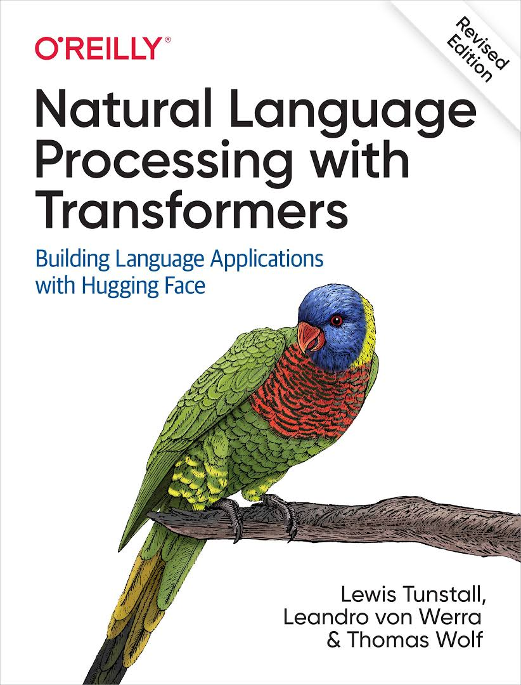

# NLP with Transformers

<table>
    <tr>
        <td></td>
    </tr>
</table>

[**Natural Language Processing with Transformers (Tunstall et al., 2022)**](https://github.com/nlp-with-transformers/notebooks). Written by the creators of Hugging Face Transformers, the book provides a practical perspective on the Transformer architecture and its NLP applications. 
