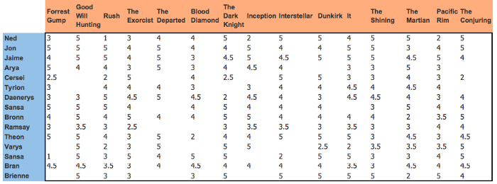
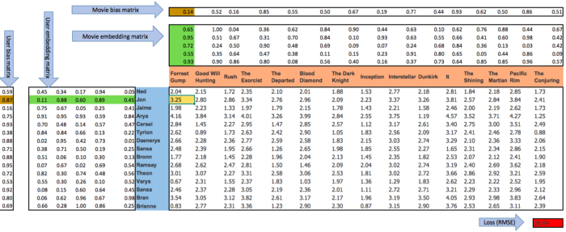
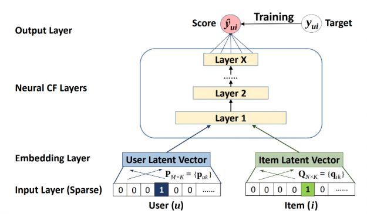

## 8 - COLLABORATIVE FILTERING DEEP DIVE

One common problem is having a number of users and a number of products, and you want to recommend which products are most likely to be useful for which users.

A general solution to this problem is called **collaborative filtering** and it works like this: 
1. look at which products the current user has used or liked.
2. find other users who have used or liked similar products.
3. recommend other products that those users have used or liked.

### MovieLens data

We can represent the matchings between each user and each movie as a giant matrix. The empty cells in that matrix would be the things our model should learn to fill in. Those are the places where a user has not reviewed the movie yet, presumably because they have not watched it. For each user,we would like to know which of those movies they might be more likely to enjoy.

If we knew for each user to what degree they liked each important category that a movie might fall into, such as genre, age, preferred riectors and actors, and so forth, and we knew the same information about each movie, then a simple way to fill in this table would be to multiply this information together for each movie and use a combination.

For instance, if we consider 3 aspects such as "science fiction degree", "novelty degree", and "action degree" where each of these aspects lies in the [-1, 1] range, we could represent movies and user likes in the following way:

```
star_wars: [0.98, -0.9, 0.9]
casablanca: [-0.99, -0.97, 0.4]
user_1: [0.9, -0.6, 0.8]


(user_1 * star_wars).sum = 2.14
(user_1 * casablanca).sum = 0.01
```

We can see that user 1 likes old movies from the science fiction genre with much action. We can check for a match by multiplying and summing. By doing so, we see that Star wars may be a good recommendation, but Casablanca may not be a good one.

It is generally impossible to know beforehand the true means of our representation. That is why they are known as **latent factors**. Since we don't know what the latent factors are, and we don't know how to score them for each user and movie, we should **learn them**.

### Learning the latent factors
The idea for our movie ratings example is to randomly initialize some parameters (i.e., the set of latent values for each user and movie). Then, optimize these parameters using **stochastic gradient descent** with a loss function such as the **mean square error**.

At each step, the optimization process will calculate the match between each movie and each user using the dot product and will compare it to the actual rating that the user gave to each movie. I will then calculate the derivative of this value and step the weights by multiplying this by the learning rate. This will iteratively improve the loss and the recommendations.

**Note on sparse data:** The main idea is to learn latent factors using only the observed data. That way, we can work with sparse matrices. Nevertheless, we can use the learned model to predict never-seen data instances and then use that information to make recommendations.

### Creating the DataLoader

For collaborative filtering, we can use a specific version of DataLoaders called the <code>CollabDataLoaders</code> class. Each resulting row will consider a user and an item. We can specify the item with <code>item_name</code> (see page 258).

### Collaborative filtering from scratch

To calculate the estimated rating for a particular movie and user combination, we have to look up the index of the movie in our movie latent factor matrix and the index of the user in our user latent factor matrix. Then, we can do our dot product between the two latent factor vectors.

We can represent **look up in an index** as a matrix product. The trick is to replace our indices with one-hot encoded vectors.

We prefer to do a matrix product instead of an index iteration to allow **vectorization** and a better integration with the deep learning framework.

**Example:**
```
user_factor[3]  ----->  [0.8, 0.7, 0.1, -0.2]

one_hot_3 = one_hot(3, n_users).float()
user_factor.t() @ one_hot_3  -----> [0.8, 0.7, 0.1, -0.2]
```

If we do this for a few indices at once, we will have a matrix of one-hot-encoded vector, and that operation will be a matrix multiplication. The result is an **embedding matrix**.

* **One-hot-encoded vector:** its purpose is to signal which combinatios of user/item are present in the data. That information will be used for learning the embedding matrix.
* **Learning process**: the traditional collaborative filtering approach uses matrix multiplication and evaluates the result with minimum square loss. It compares the "predicted" score for user/item with the real score assigned by the user, where the loss is the mean squared error (considering all of the data instances).
* **Updating the embedding matrix:** There are different approaches, but a traditional way (that can be extended for deep learning) is to use backpropagation with gradient descent. The embedding matrix is thus considered a matrix of "parameters".

**Note on updating embedding matrices:** https://forums.fast.ai/t/how-do-we-actually-update-embedding-matrices/17005

**Note on sigmoid range:** Generally, user preferences will live in a specific range (e.g., 0-5, 0-10). We can improve the performance of our model by restricting its predictions to this problem-specific range using the **sigmoid function**.

### Inference and recommendations


**Note:** This idea is independent of the specific model that we use (e.g, if we consider biases or if we use deep learning instead of dot product matrix factorization).

### Embeddings and biases

If we only consider the embedding matrix resulted from the dot product, we are ignoring both the user bias and the item bias. In our movies example, there could be some users that are just more positive or negative in their recommendations than others, and there could be some movies that are just plain better or worse than the others.

In order to represent biases, we could add two extra latent matrices with a single column (i.e., a vector); one for representing user bias, and another for representing movie bias. Then, we would add this bias to the model prediction:

```
x[:,0] ----> user column of the user-movie combinations, ":" represents all data instances
x[:,1] ----> movie column of the user-movie combinations, ":" represents all data instances

(users_latent(x[:,0]) * movies_latent(x[:,1])).sum(dim=1) + user_bias(x[:,0]) + movie_bias(x[:,1])
```





### Weight decay

**Weight decay**, or **L2 regularization**, consists of adding to your loss function the sum of all the weights squared. 

* **Why do that?** Because when computing the gradients, it will add a contribution to them that will encourage the weights to be as small as possible.
* **Why would it prevent overfitting?** The general idea is that the larger the coefficinets are, the sharper canyons we will have in the loss function. So, letting our model learn high parameters might cause it to fit all the data points in the training set with an overcomplex function that has very sharp changes, whi will lead to overfitting.

Of course, limiting our weights from growing too much is going to hinder the training of the model, but it will generally yield a state where it generalizes better.

### Bootstrapping collaborative filtering (i.e., cold-start problem)

The biggest challenge with using collaborative filtering models in practice is the bootstrapping or cold-start problem. The most extreme version of this problem is having no users, and therefore no history to learn from. What products do you recommend to your very first user?

A simple solution for a new user is to assign the mean of all of the embedding vectors of your other users, , but this has the problem that particular combination of latent factors may be not at all common (for instance, the average for science-fiction factor may be high, and the average for the action factor may be low, but it is not that common to find people who like science finction without action). In this simple case, **it would probably be better to pick a particular user to represent the average taste**.

Better still is to use a tabular model based on user metadata to cnstruct your initial embedding vector. When a user signs up, think about what questions you could ask to help you understand their tastes. Then, you could create a model in which the target variable is a user's embedding vector (**multi-target regression**), and the features are the results of the questions you ask them, along with the sgnup metadata. 

More information on this problem can be found on page 271.

### Deep learning for collaborative filtering

Neural networks learn deep non-linear relationships between users and items better than matrix factorization, and can scale to handle sparse inputs much better than matrix factorization with its dot product. 

To turn matrix factorization into a deep learning model, we are going to substitute dot product with a neural network model. To do that, we first concatenate the outputs of the user and item embedding matrices and fed them into a set of neural layers that predicts whether the input user is likely to interact with the input item.



Since we'll be concatenating the embedding matrices, rather tan taking their do product, the two embedding matrices can have different sizes (different number of latent factors). FastAI has a function <code>get_emb_sz</code> that returns recommended sizes for embedding matrices for your data, based on a heuristic that FASTAI has found to work well in practice.

```
embs = get_emb_sz(dls)
embs
# 944 unique users with a 74-dimension latent space, and 1635 unique movies with a 101-dimension latent space
[(944, 74), (1635,101)] 
```

### Complex deep learning architectures

https://developer.nvidia.com/blog/how-to-build-a-winning-recommendation-system-part-2-deep-learning-for-recommender-systems/