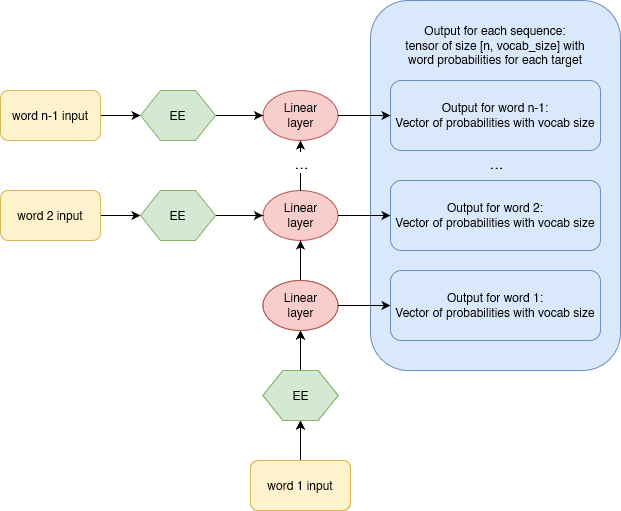
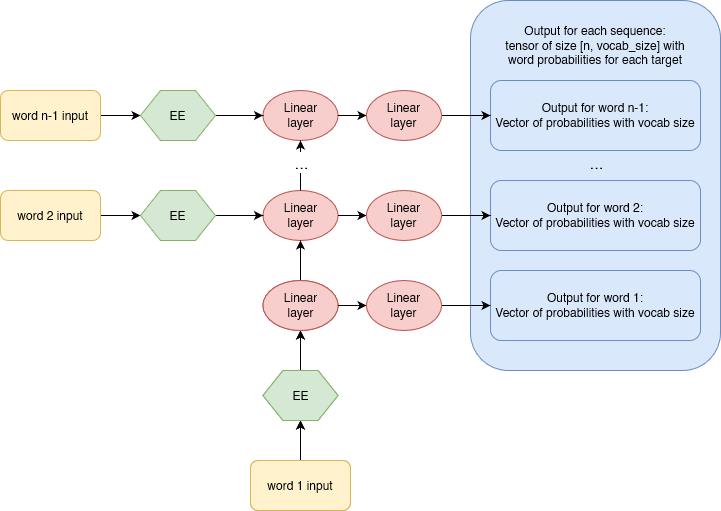
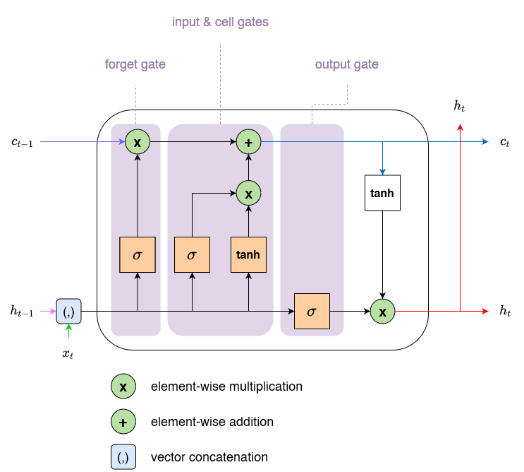
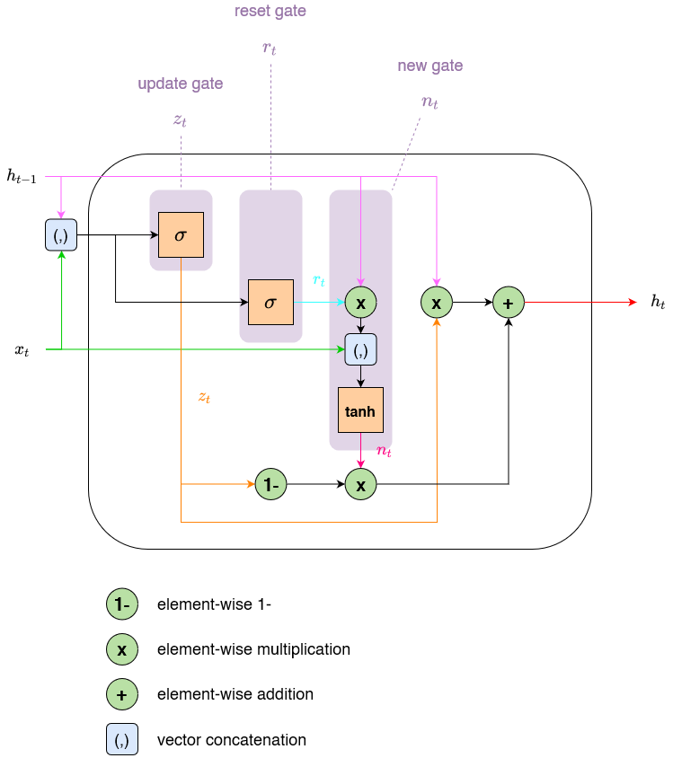

## 12 - A LANGUAGE MODEL FROM SCRATCH

### Basic recurrent neural network

One of the simplest approaches to a language model is to build a neural network that predicts each word based on a number `n` of previous words. This model takes `n` inputs and returns a prediction of the probability of each possible next word in the vocab. The loss is simply the 1 - the predicted probability for the right word in the vocabulary.

As an overview of the corresponding architecture, we would have:
* The embedding layer, which would transform each word to a one-hot encode and then to a numeric vector.
* The linear (hidden) layer, which creates the activations that are fed from each word to the next. The traditional activation function is the RELU.
* The linear (output) layer, which predicts the `n+1` word (the target).


A neural network that is defined using a loop like this is called a recurrent neural network (RNN). It is important to realize that an RNN is not a complicated new architecture, but simply a refactoring of a multilayer neural network using a `for` loop.

**PyTorch code:**

```python

# Language model using a simple RNN with a single hidden layer for each word
class LMModel(Module):

	"""
	vocab_sz: Number of unique words in the data
	seq_len:  n, the number of words considered to predict the n+1 word (target)
	n_hidden: number of hidden dimensions in the embedding and in the hidden
			layers. We are considering a constant activation architecture (i.e.,
			vocab_sz -> n_hidden -> n_hidden -> vocab_sz)
	"""
	def __init___(self, vocab_sz, seq_len, n_hidden):
		self.i_h = nn.Embedding(vocab_sz, n_hidden)	# input-hidden
		self.h_h = nn.Linear(n_hidden, n_hidden) 	# hidden-hidden
		self.h_o = nn.Linear(n_hidden, vocab_sz) 	# hidden-output
		self.sl = seq_len
		
	def forward(self, x):
		h = 0 # automatic broadcasting to the appropriate size
		for i in range(self.sl):
			h = h + self.i_h(x[:,i])
			h = F.relu(self.h_h(h))
		return self.h_o(h)
```

### Improving the RNN

#### Maintaining the state of an RNN

Since we initialize the model's hidden state to zero for each new sample (i.e., batch), we are throwing away all the information we have about the sentences we have seen so far, which means that our model does not  actually know where we are up to in the overall word sequence. This is easaily fixed by moving the initialization of the hidden state to `__init__`.

However, this fix will create its own subtle, but important, problem. It effectively makes our neural network as deep as the entire number of words in our document. For instance, if there were 10000 words, we would be creating a 10000-layer neural network. This can be easily understood if we consider the unrolled representation of the RNN.


The obvious problem of a 10000-layer  neural network is the computational cost of calculating derivatives all the way back to the first layer. In addition, it would be so memory-intensive that we could not store even a single mini-batch in the GPU.

The solution to this problem is to not backpropagate (backward pass) the derivatives through the entire implicit neural network. Instead, we will keep just the last `n` layers of gradients. The resulting model will have the same activations (forward pass) whatever sequence length `n` we pick, because the hidden state will remember the last activation from the previous batch. The only thing that will be different is the gradients computed at each step: they will be calculated on only sequence length words in the past, instead of the whole stream. This approach is called ** truncated backpropagation through time (BPTT)** [Jaeger, 2002].

One of the consequences of this **approximation** is that the model focuses primarily on short-term influence rather than long-term consequences. This is actually desirable, since it biases the estimate towards simpler and more stable models.

In PyTorch, we implement this approach through the `detach` method.

**PyTorch code:**

```python

class LMModel_state(Module):

	def __init___(self, vocab_sz, seq_len, n_hidden):
		self.i_h = nn.Embedding(vocab_sz, n_hidden)	# input-hidden
		self.h_h = nn.Linear(n_hidden, n_hidden) 	# hidden-hidden
		self.h_o = nn.Linear(n_hidden, vocab_sz) 	# hidden-output
		self.sl = seq_len
		self.h = 0 # automatic broadcasting to the appropriate size
		
	def forward(self, x):
		for i in range(self.sl):
			h = h + self.i_h(x[:,i])
			h = F.relu(self.h_h(h))
		out = self.h_o(self.h)
		self.h = self.h.detach() # truncate backpropagation through time
		return out
```

To use `LMModel_state`, we need to make sure the samples are going to be seen in a certain order so we can properly exploit the maintained state. This way, if the first sequence of the first batch is `dset[0]`, the second batch should have `dset[1]` as the first sequence, so that the model sees the text flowing. This can be easily understand if we think of it in matrix form, since a forward call is make for each batch and the operations are done "simultaneously" on the whole batch.

FastAI implicitly does this for us when using `LMDataLoader`.

#### Creating more signal for our RNN

Another problem with `LMModel` is that we predict only on output word for each `n` input words. As a result, the amount of "signal" that we are feeding back to update the weights is not as large as it could be. It would be better if we predicted the next word after every single word, rather than every `n` words.


Unrolled version:



In order to do this, each sequence could have both a number `n` of input words and a number `n` of target words. The second list will be the same as the first, but offset by one element (the first of the input list and the last of the target list). Easy to see with an example:

```python

[L(vocab[o] for o in s) for s in seqs[0]]

>>> [(#6) ['one','.','two','.','three','.'],
	 (#6) ['.','two','.','three','.','four']]
```

Now, we need to modify our model so that it ouputs a prediction after every word, rather than just at the end of a n-word sequence:

```python

class LMModel_state_signal(Module):

    def __init__(self, vocab_sz, seq_len, n_hidden):
		self.i_h = nn.Embedding(vocab_sz, n_hidden)	# input-hidden
		self.h_h = nn.Linear(n_hidden, n_hidden) 	# hidden-hidden
		self.h_o = nn.Linear(n_hidden, vocab_sz) 	# hidden-output
		self.sl = seq_len
        self.h = 0 # automatic broadcasting to the appropriate size
        
    def forward(self, x):
        outs = []
        for i in range(self.sl):
            self.h = self.h + self.i_h(x[:,i])
            self.h = F.relu(self.h_h(self.h))
            outs.append(self.h_o(self.h))
        self.h = self.h.detach() # truncate backpropagation through time
        return torch.stack(outs, dim=1)
    
    def reset(self): self.h = 0
```

By predicting multiple words per sequence, the shape of the output matrix will change to `[batch_sz, seq_len, vocab_sz]`. However our targets are of shape `[batch_sz * seq_len, vocab_sz]`, so we need to flatten those before using them with our cross-entropy loss function. For that, we use `torch.view`:

```python
def loss_func(inp, targ):
    return F.cross_entropy(inp.view(-1, len(vocab)), targ.view(-1))
```

* The resulting `input` view has a number of columns equal to the vocabulary size and a number rows equal to `batch_sz * seq_len`

* The resulting `targ` has a single column (the index in the vocabulary of the target word) and a number of rows equal to `batch_sz * seq_len` (i.e., a vector)

**Note:** Remember that view only changes the form of the tensor, not its data, 
* `view(-1)` transforms a tensor into a 1-dim vector.
* `view(-1, len(vocab_sz) )` transforms a tensor into a 2-dim matrix with `len(vocab_sz)` number of columns

**Examples:**

```python
a = torch.randn(3, 2, 5)
a

>>> tensor([[[-1.1680,  0.3262, -0.8672, -0.1153, -0.5379],
         [-1.4572, -0.4784, -1.1459,  0.5212,  0.3551]],

        [[ 0.4770,  1.4954,  0.3420, -0.5448,  0.3570],
         [ 0.2030, -0.0864,  1.4416,  0.0626, -0.3554]],

        [[ 0.2155,  0.0294, -0.1451,  0.4269,  1.1903],
         [-0.1521,  0.1964,  1.1927,  0.6344,  0.3757]]])
```

```python
a.view(-1, 5)

>>> tensor([[-1.1680,  0.3262, -0.8672, -0.1153, -0.5379],
        [-1.4572, -0.4784, -1.1459,  0.5212,  0.3551],
        [ 0.4770,  1.4954,  0.3420, -0.5448,  0.3570],
        [ 0.2030, -0.0864,  1.4416,  0.0626, -0.3554],
        [ 0.2155,  0.0294, -0.1451,  0.4269,  1.1903],
        [-0.1521,  0.1964,  1.1927,  0.6344,  0.3757]])
```

```python
a.view(-1)

>>> tensor([-1.1680,  0.3262, -0.8672, -0.1153, -0.5379, -1.4572, -0.4784, -1.1459,  0.5212,  0.3551,  0.4770,  1.4954,  0.3420, -0.5448,  0.3570,  0.2030, -0.0864,  1.4416,  0.0626, -0.3554,  0.2155, 0.0294, -0.1451,  0.4269,  1.1903, -0.1521,  0.1964,  1.1927,  0.6344,  0.3757])
```

### Multilayer RNNs

The obvious way to get a better model is to go deeper and consider multiple linear layers between the hidden state and the output activations in our RNN. This approach is known as **multilayer RNN**.

In a multilayer RNN, we pass the activations from our recurrent neural network into a second recurrent neural network:

**Example of a 2-layer RNN:**




#### Exploding or dissapearing activations

In practice, creating accurate models from this kind of RNN is difficult because of what happens when you multiply by a number many times. Multiplying by a number even slightly higher or lower than 1 results in an explosion or disappearance of our starting number, after just a few repeated multiplications.

Now, because matrix multiplication is just multiplying numbers and adding them up, exactly the same thing happens with repeated matrix multiplications. And that is all a deep neural network is, where each layer is another matrix multiplication. This means that is very easy for a deep neural network to end up with extremely large or extremly small numbers.

This is a huge problem in computer science due to the nature of floating point numbers, which become less and less accurate the further away the numbers get from zero. This inaccuracy means that often the calculated gradients end up as zero or infinity for deep networks. This is commonly referred to as the **vanishing gradients or exploding gradients problem**. It means that in SGD, the weights are either not updated at all or jumpt to infinity. Either way, they won't improve with training.

**Exploding activations:**


The problem of exploding activations could be solved by using `tanh` function so the values are limited to the [-1, 1] range, However, this would not protect us from the vanishing activations problem, where small changes in the gradient stop our model from training.

**`tanh` activation function:**


Researchers have developed two main ways to tackle this problem:

* Being careful about initialization.
* Change the definition of a layer in a way that makes it less likely to have exploding activations (e.g., batch normalization, RestNets). For RNNs specifically, two types of layers are frequently used to avoid this problem: **gated recurrent units** (GRUs) and **large short-term memory** (LSTM) layers.

### LSTM

In the LSTM architecture [Hochreiter and Schmidhuber, 1997], there are not one, but two, hidden states. In our base RNN, the hidden state `h` is the output of the RNN at the previous time step. That hidden state is responsible for two things:

* Having the right information for the output layer to predict the correct next word.
* Retaining memory of everything that happened in the sentence.

In practice, RNNs are really bad at retaining memory of what happened much earlier in the sentence, which is the motivation to have another hidden state (called **cell state**) in the LSTM.
* The cell state will be responsible for keeping long short-term memory.
* The hidden state will focus on the next token to predict.



**Explanation of the LSTM cell architecture**
* Our input `x_t` enters on the left with the previous hidden state `h_t-1` and cell state `c_t-1`. 
* The four orange boxes represent four linear layers with the activation being either sigmoid or tanh. They are usually called gates.
* The green circles are elementwise operations.

Lets go over the diagram:

First, the input and old hidden state are joined together. In the RNN, we were adding them together. However, in the LSTM, we stack them into one big tensor. **This means the dimension of our embeddings `n_in` can be different from the dimension of our hidden state `n_hid`**. Therefore all of the orange boxes are linear layers with `n_in` + `n_hid` inputs and `n_hid` outputs.

The first gate is called the **forget gate**. Since it is a linear layer followed by a sigmoid, its output will consist of scalars between 0 and 1. We multiply this result by the cell state to determine which information to keep and which to throw away: values closer to 0 are "discarded" (reduced their importance value) and values closer to 1 are kept (kept with a relevant value). This gives the LSTM the ability to "forget" things about its long-term state.

The second gate is called the **input gate**. It works in conjunction with the third gate, which is sometimes called the **cell gate**, to update the cell state. Similar to the forget gate, the input gate decides which elements of the cell state to update (values close to 1) and the cell gate determines what those update  values are, in the range of -1 to 1 (tanh). For instance, we may see a new gender pronoun, in which case we'll need to replace the information about gender that the forget gate "removed" (put close to 0).

The last gate is the **output gate**. It determines which information from the cell state to use to generate the output (for the next word). the cell state goes through a tanh before being combined with the sigmoid output of the output gate, and the result is the new hidden state.

**PyTorch code:**

```python
class LSTMCell(Module):
	
	"""
	ni: dimension of inputs, i.e., the number of embedding dimensions
	nh: dimension of hidden layers. All gates have the same dimensions
	"""
	def __init__(self, ni, nh):
		self.forget_gate = nn.Linear(ni + nh, nh)
		self.input_gate = nn.Linear(ni + nh, nh)
		self.cell_gate = nn.Linear(ni + nh, nh)
		self.output_gate = nn.Linear(ni + nh, nh)
	
	"""
	input: the embedding output for the word
	state: (h,c) tuple. Both h and c have the same number of dimensions
	"""
	def forward(self, input, state):
		h,c = state
		h = torch.cat([h, input], dim=1)
		forget = torch.sigmoid(self.forget_gate(h))
		c = c * forget
		inp = torch.sigmoid(self.input_gate(h))
		cell = torch.tanh(self.cell_gate(h))
		c = c + inp * cell
		out = torch.sigmoid(self.output_gate(h))
		h = out * torch.tanh(c)
		return h, (h,c)
```

#### Regularizing an LSTM

RNNs, in general are hard to train, because of the problem of vanishing gradients. Using LSTM (or GRU) cells makes training easier than with vanilla RNNs, but they are still very prone to overfitting.

Data augmentation, while a possibility, is less often used for text data than for images because in most cases it requires another model to generate random augmentations (e.g., translating the text into another language and then back into the original language). 

However, we can use other regularization techniques instead to reduce overfitting [Merity et al., 2017]:
* Dropout
* Activation regularization
* Temporal activation regularization

#### Dropout

The basic idea is to randomly change some activations to zero at training time. This forces neurons to "not be lazy" and makes sure all neurons actively work toward the output. In addition, by introducing some "noise" and forcing multiple neuron paths, it makes the model more robus, helping it generalize.

We can see, however, that if we were to just zero those activations without doing anything else, our model would have problems in training: if we go from the sum of five activations (that are all positive numbers since we apply ReLU) to just two, **this won't have the same scale**. Therefore, if we apply dropout with a probability `p`, we rescale all activations by multiplying them by `p` (or dividing them by `1-p`).

#### Activation regularization and temporal activation regularization

Activation regularization (AR) and temporal activation regularization (TAR) are two regularization methods very similar to weight decay (L2). 
* In weight decay, we add a small penalty to he loss that aims at making the weights as small as possible. 

```python
loss += alpha * parameters.pow(2).sum()
```
* In AR, it's the final activations produced by the LSTM that we will try to make as small as possible.

```python
loss += alpha * activations.pow(2).mean()
```

To regularize the final activations, we have to store those somewhere , then add the means (in L2 was the sum) of the squares of them to the loss (along with a multiplier alpha, hyperparameter)

* In TAR, our objective is to make the difference between two consecutive activations as small as possible by adding a penalty to the loss.

```python
loss += beta * (activations[:,1:] - activations[:,:-1]).pow(2).mean()
```

**Note:** In the chapter notebook I have included an example to better understand this formula. 

To make AR and TAR work, we need our model with dropout to return three things: the proper output, the activations of the LSTM pre-dropout, the activations of the LSTM post-dropout.

* AR is often applied on the dropped-out activations (to not penalize the activations we turned into zeros afterwards).
* TAR is applied on the non-dropped out activations (because those zeroes create big differences between two consecutive time steps).

In PyTorch, both the dropped-out activations and the non-dropped out activations are the picked up by the `RNNRegularization` callback for the contributions it has to make to the loss.

#### Weight tying

Another usefult trick to improve trining in LSTMs is **weight tying**. In a language model, the input embeddings represent a mapping from words to activations, and the output hidden layer represents a mapping from activations to words. 

We might expect, intuitively, that these mappings could be the same. We can represent this in PyTorch by assignning the same weight matrix to each of these layers:

```python
self.h_o.weight = self.i_h.weight
```

#### All together, weight-tied regularized LSTM

```python
class LMModel_WeightTiedLSTM(Module):

	"""
	vocab_sz: size of the vocabulary
	n_input: number of latent dimensions in the embedding
	n_hidden: number of hidden dimensions in the linear layers (inside LSTM)
	n_layers: number of LSTM cells
	p: dropout probability
	"""
	# n_input and n_hidden do not need to be the same if we use weight-tying (or we would need another specific layer to transform)
	def __init__(self, vocab_sz, n_input, n_hidden, n_layers, p):
		self.i_h = nn.Embedding(vocab_sz, n_input)
		self.rnn = nn.LSTM(n_input, n_hidden, n_layers, batch_first=True) 
		self.drop = nn.Dropout(p)
		self.h_o = nn.Linear(n_hidden, vocab_sz)
		self.h_o.weight = self.i_h.weight
		self.h = [torch.zeros(n_layers, bs, n_hidden) for _ in range(2)]
		
	
	def forward(self, x):
		raw, h = self.rnn(self.i_h(x), self.h) # raw output response, h, c
		out = self.drop(raw) # dropout
		self.h = [h_.detach() for h_ in h]
		return self.h_o(out), raw, out # raw and out are used by RNNRegularer callback
	
	def reset(self):
		for h in self.h: h.zero()
		
```

We can create a regularized `Learner` using the `RNNRegularizer` callback:

```python
learn = Learner(dls, LMModel_WeightTiedLSTM(len(vocab), 64, 2, 0.5),
                loss_func=CrossEntropyLossFlat(), metrics=accuracy,
                cbs=[ModelResetter, RNNRegularizer(alpha=2, beta=1)])
```

**important note:**  Although in theory this should work, there are current issues with RNNRegularer and the tuple returned by the `forward` method. I should look more into it. Neverhteless, we can instead use `TextLearner`, which seems to work fine.

### Extra: Gated recurrent units

Gated recurrent unit (GRU) is a new generation of RNN that can be seen as a variation of LSTM given that both are designed similarly and, in some cases, produce equally excellent results.

Compared to LSTM, GRU got rid of the cell state and used the hidden state to transfer information. It is composed of three main gates:
* **Update gate** (`z_t`).
* **Reset gate** (`r_t`)
* **New gate** (`n_t`)

**Diagram:**



**Equations:**

TODO: Put my own equations because those in the image are wrong (concatenation and  element-wise addition are confused)

**PyTorch code: note; similar to LSTM-CELL, it needs a bit of testing and we can use the for loop of the NLP course to generate a full LSTM model**

```python
class GRUCell(Module):
	
	def __init__(self, ni, nh):
		self.update_gate = nn.Linear(ni + nh, nh)
		self.reset_gate = nn.Linear(ni + nh, nh)
		self.new_gate = nn.Linear(nh + nh, nh)
		
	def forward(self, input, state)
	h = state
	x = input
	hx = torch.cat([h, x], dim = 1)
	update = torch.sigmoid(self.update_gate(hx))
	reset = torch.sigmoid(self.reset_gate(hx))
	reset = reset * h
	rx = torch.cat([reset, x], dim = 1)
	new = torch.tanh(rx)
	out = (update * new) + (1 - update) * h
	return out
```

### Extra: Batch normalization


## References

Jaeger, H. (2002). Tutorial on training recurrent neural networks, covering BPPT, RTRL, EKF and the ”echo state network” approach. Vol. 5. GMD-Forschungszentrum Informationstechnik Bonn.

Hochreiter, S. and J. Schmidhuber (1997). Long short-term memory. Neural Computation 9(8): 1735-1780.

Merity, S, et al. (2017). Regularizing and optimizing LSTM language models. arXiv:1708.02182.

Cho, Kyunghyun et al. (2014). On the Properties of Neural Machine Translation: Encoder-Decoder Approaches. arXiv:1409.1259