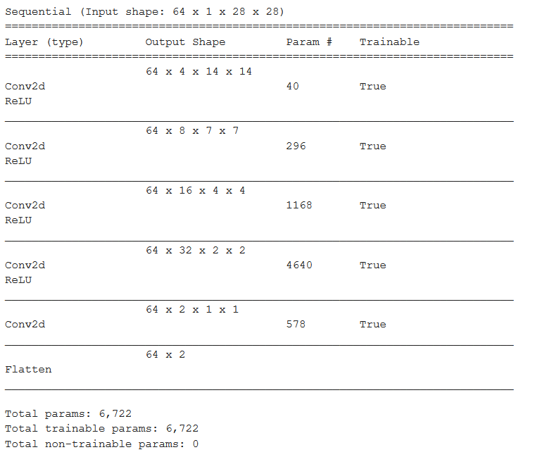
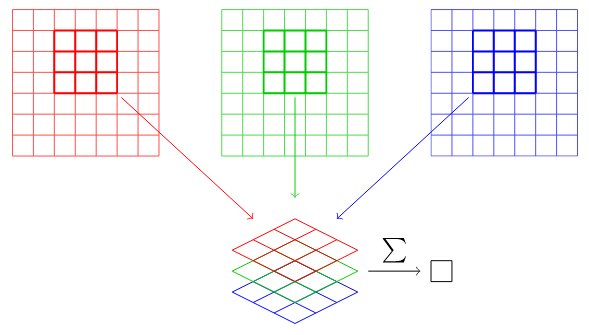
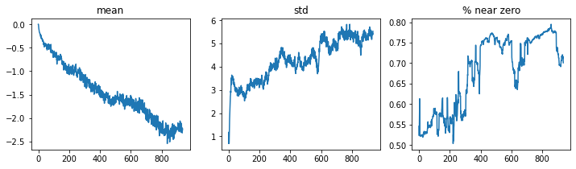
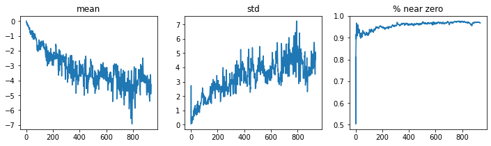
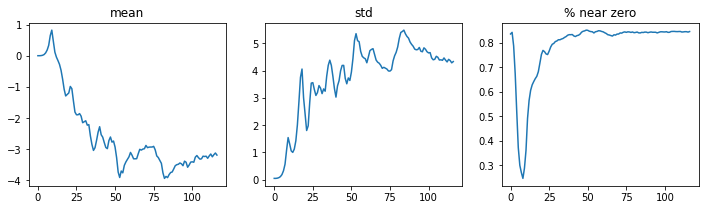
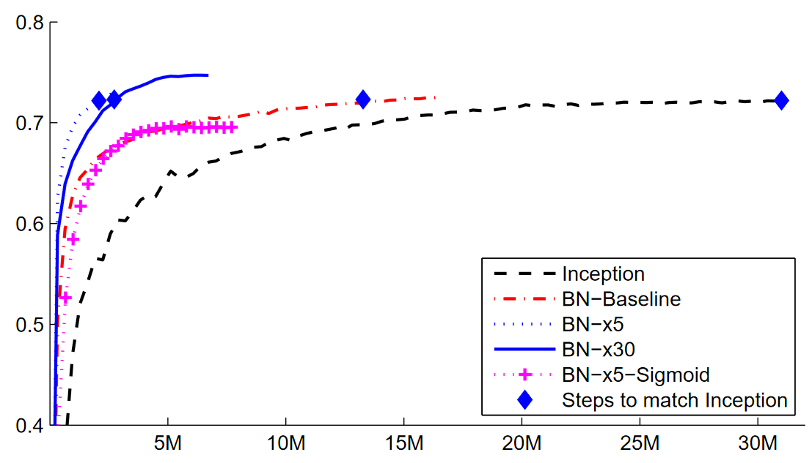

## 13 - CONVOLUTIONAL NEURAL NETWORKS

TODO: Pooling

**Note:** We use kernel and filter incerchangibly in these notes. However, kernel is sometimes referred as a multidimensional filter (i.e., composed from multiple filters). For example in  RGB images, which have 3 channels, and therefore each kernel  would consiste of a filter on each channel.

### The magic of convolutions

One of the most powerful tools in ML is  feature engineering, which transforms the data by generating new features that make it easier to model.

In the context of an image, a feature is a visually distinctive attribute. For example, the number 7 is characterized by a horizontal edge near the top of the digit, and a top-right to bottom-left diagonal edge underneath that. So what if we could extract information about where the edges occur in each image, and then use that information as our features instead of raw pixels?

It turns out that finding the edges in an image is a very common task in computer vision and is surprisingly straightforward. To do it, we use something called a **convolution**. A convolution requires nothing more than **multiplication** and **addition**.

A convolution applies a **kernel** (i.e., filter) across an image. A kernel is a little matric such as the following:

```python
top_edge = torch.tensor([-1,-1,-1], 
						[0, 0, 0], 
						[1, 1, 1]).float()
```

This specific kernel would be interesting for detecting top horizontal edges in a figure (edges that go from light at the top to dark at the bottom). The application of a kernel (i.e., convolution operation) to an image is simple. It multiplies each element of the kernel by each element of a 3x3 block of the image. The results of thesemultiplications are then added together. For example:


Changing our kernel to have the row of 1s at the top and the -1s at the bottom would detect horizontal edges that go from dark at the top to light at the bottom. Additionally, putting the 1s and -1s in columns versus rows would give us filters that detect vertical edges. Each set of weights of the kernel will produce a different kind of outcome.

### Mapping a convolutional kernel

The application of a kernel over an image generates an output activation map, also known as an **output feature map**. If there are multiple input feature maps, the kernel will have to be 3-dimensional – or, equivalently each one of the feature maps will be convolved with a distinct kernel – and the resulting feature maps will be summed up elementwise to produce the output feature map.


In this example, we would have two input maps and three kernels.

### Strides and padding

When applying a kernel with 0 padding, the resulting output map will usually have a lower height and width than the original input map. The reason being that we are limiting the space this kernel can move thorugh the image (we do not allow it to go over the image limits):


A simple way to increase the size of the output map is to consider **padding**, which is simplyto add additional pixels around the outside of our image. Most commonly in the form of zeros. With appropriate padding, we can ensure that the output activation map is the same size as the original image, which can make things a lot simpler when we construct our architectures. The following image shows giw adding padding allows us to apply the kernel in the image corners:


If we add a kernel of sie `ks` by `ks` (with `ks` being an odd number), the necessary padding on each side to keep the same shape is `ks//2`. An even number for `ks` would require a diffeent amount of padding on the top/bottom and left/right, but in practice we almost never use an even kernel size.

Another aspect that affects the shape  of the output map is the **stride**, i.e., the distance between two consecutive positions of the kernel. Increasing the stride would also decrease the size of our outputs. We normally use stride-1 convolutions for adding layers without changing the output size, and we use stride-2 or more to decrease the size of our outputs.

The formula for estimating the size of each dimension in the output map is as follows (where `pad` is the padding, `ks` is the kernel dize, and `stride` is the stride):

`(n + 2*pad - ks) // stride + 1`

### Convolutions in PyTorch

Convolution is such an important and widely used operation that <a href="https://pytorch.org/docs/stable/generated/torch.nn.Conv2d.html">PyTorch has it built in</a>. 

#### Creating a Convolutional neural network in PyTorch

Manually establishing our own kernels is not feasible. Especially when we get deeper and deeper into the network, where convolutionalkernels become complex transformations of features from lower levels.

Instead, it would be best to learn the values of the kernels using an optimization method such as SGD. In effect, the model will learn the features that are useful for classification. When we use convolutions instead of (or in addition to) regular layers, we create a convolutional neural networks (CNN).

In order to create a CNN, we will use PyTorch module `nn.Conv2d`. It is very convenient because it automatically creates the kernel weight matrix when instantiating it.

As an example, lets consider the basic neural netowkr we had in Chapter 4 for the MNIST example:

```python

simple_nn = nn.Sequential(
			nn.Linear(28*28, 30),
			nn.ReLU(),
			nn.Linear(30,1)
)

```

We now want to create asimilar architecture but using convolutional layers instead of linear. Here is a possible architecture:

```python

broken_cnn = nn.Sequential(
	nn.Conv2d(1,30, kernel_size=3, padding=1)
	nn.ReLu(),
	nn.Conv2d(30,1, kernel_size=3, padding=1)
)

```

One thing to note here is that we did not need to specify `28*28` as the input size. That's because a linear layer needs a weight in the weight matrix for every pixel, so it needs to know how many pixels there are, but a **convolution is applied over each pixel automatically**. The kernel weights depend only on the number of input and output channels and, of course, the kernel size.

The problem with this architecture is the shape of the result:

```python

broken_cnn(xb).shape # xb has a batch size of 64

> toch.Size([64, 1, 28, 28])

```

This is not something we can use to do classification, since we need a single output activation per image, not a 28x28 map  of activations. One way to deal with this is to use enough stride-2 convolutions such that the final layer is size 1. After one stride-2 convolution, the size will be 14x14; after two, it will be 7x7; then 4x4, 2x2, and finally size 1.

We can use the following function to avoid inconsistencies in our defined architecture:

```python

def conv(ni, nf, ks=3, act=True):
	res=nn.Conv2d(ni, nf, stride=2, kernel_size=ks, padding=ks//2)
	if act: res= nn.Sequential(res, nn.ReLU())
	return res
```

When we use a stride-2 convolution, we often double the number of filters (i.e., kernels) to avoid changing the amount of computation in deeper layers. If we left the number of filters the same, the amount of computation done in the net would get less and less as it gets deeper. However, we know that the deeper layers have to compute semantically rich features, so we wouldn't expect that doing less computation would make sense.

Here is how we can build a simple CNN using previous function:

```python

simple_cnn = nn.Sequential(
		conv(1, 4), 			# 14x14
		conv(4, 8), 			# 7x7
		conv(8, 16), 			# 4x4
		conv(16, 32),			# 2x2
		conv(32, 1, act=False),	# 1x1
		Flatten()
)
```

The comments after each convolution allows us to show how large the activation map will be after each layer. Note, however, that these comments assume an input size of 28x28.



Note that the output of the final `Conv2d` layer  is 64 x 2 x 1 x 1. We need to remove those extra 1x1 axes; that is what `Flatten` does. It is basically the same as PyTorch's `squeeze` method, but as a module.

### Receptive fields

The *receptive field* is the area of an image that is involved in the calculation of a layer. This concept allows us to better understand why deeper convolutions require a higher number of filters to offset the reduced dimensionality of their corresponding output maps.

Let's consider a simple example from MNIST wtih two convolutional layers, each of stride-2 and with a kernel size of 3.

In this example, we can see that a 7x7 area of cells in the input layer is used to calculate a single green cell in the `Conv2` layer. This 7x7 area is the receptive field in the input of the green activation in `Conv2`.

As you can see from this example, the deeper we are in the network (specifically, the more stride-2 convolutions we have before a layer), the larger the receptive field  for an activation in that layer is. A large receptive field means that a large amount of the input image is used to calculate each activation in that layer. We now know that in the deeper layers of the network, we have semantically rich features, corresponding to larger receptive fields. Therefore, we'd expect that we'd need more weights for each of our features to handle this increasing complexity. This is another way of saying the same thing we metioned in the previous section: when we introduce a stride-2 convolution in our network, we should al so increase then number of filters (i.e., kernels).

### Color images

Previous examples have considered images with a single black/white channel. We had tensors of the form `[64, 1, 28, 28]`, where 64 is the batch size, 1 is the number of channels and 28x28 are image dimensions.

When dealing with color images, we have multiple channels. In RGB, we have specifically 3. In this case, we need as many filters as channels. So our kernel doesn't have a size of `[3, 3]`, but `[ch_in, 3, 3]`, where `ch_in` referes to the number of input channels.



So, in order to apply a convolution to a color picture, we require a kernel tensor that matches the number of input channels. That is, if we use an RGB picture the first kernel tensor should consider 3 input channels (`ch_in`). The application of the kernel on each of these channels will generate a number of output map functions that will be added together. The number of output channels of a convolution will depend on the number different kernels that we consider, which as previously discussed will probably increase as we get deeper into the network.

In PyTorch, the dimensions of our multidimensional kernel would then be [ch_out, ch_in, ks, ks], where we would have a number of ch_out filters that would simultaneously apply on each of the ch_in channels (then combined) with size ks x ks.

**Note on processingcolor images:** There are lots of ways of processing color images. For instance, we can change them to black and white, change from RGB to HSV (hue, saturation, and value) color space, and so forth. In general, it turns out experimentally that changing the encoding of colors won't make any difference to our model results, as long as we don't lose information in the trasnformation. So, transforming to black and white is generally a bad idea, since it removes the color information entirely (and this can be critical; for instance, a pet breed may have a distincitve color); but converting to SV generally won't make any difference.

### Improving training stability

As we discussed earlier, we generally want to double the number of filters each time we have a stride-2 layer. One way to increase the number of filters throughout our network is to double the number of activations in the first layer - then every layer after that will end up twice as big as in the previous version as well.

But this creates a subtle problem. Consider the kernel that is being applied to each pixel. By default, we use a 3x3-pixel kernel. Therefore there are a total of 9 pixels that the kernel is being applied to at each location. Previously, our first layer had four output filtes. So four values were being computed from nine pixels at each location. However, imagine that we want to double this number. In that case, we would be computing 8 numbers for 9 pixels. That means it isn't learning much at all: the output size is almost the same as the input sieze. Neural networks willcreate useful featers only if they are forced to do so. That is, **if the number of outputs is significantly smaller than the number of inputs**. To fix this, we can use a larger kernel in the first layer. For example, we could consider 8 filters for a 5x5 kernel.

Let's define this simple CNN for the multi-class (10 classes) MNIST case:

```python

def simple_cnn():
	return nn.Sequential(
			conv(1, 8, ks=5), 			# 14x14
			conv(8, 16), 				# 7x7
			conv(16, 32), 				# 4x4
			conv(32, 64),				# 2x2
			conv(64, 10, act=False),	# 1x1
			Flatten()
)
```

FastAI allow us to look inside our models while they are training in order to try to find ways to make them train better. To do this, we use the `ActivationStats` callback, which records the mean, standard deviation, and histogram of activations of every trainable layer:

```python

from fastai.callback.hook import *

def fit(epochs=1):
    learn = Learner(dls, simple_cnn(), loss_func=F.cross_entropy,
                    metrics=accuracy, cbs=ActivationStats(with_hist=True))
    learn.fit(epochs, 0.06) # Note the high learning rate
    return learn
	
learn = fit()

learn.activation_stats.plot_layer_stats(0)

```

The execution of this code will result in the following plots:



Generally our model should have a consistent, or at least smooth, mean and standard deviation of layer activations during training. Activations near zero are particularly problematic, because it means we have computation in the model that's doing nothing at all (since multiplying by zero gives zero). When you have some zeros in one layer, they will therefore generally carry over to the next layer... which will then create more zeros. Here's the penultimate layer of our network:



As expected, the problems get worse toward the end of the network, as the instability and zero activations compound over layers. Let's look at what we can do to make training more stable.

#### Increase Batch size

One way to make training more stable is to increase the batch size. Larger batches have gradients that are more accurate, since they are calculated from more data. On the downside, though, a larger batch size means fewer batches per epoch, which means fewer opportunities for your model to update weights. 

#### 1cycle Training

Our initial weights are not well suited to the task we're trying to solve. Therefore, it would be very dangerous to consider a high learning rate such as 0.06: we may very well make the training diverge instantly. We probably don't want to end training with a high learning rate either, so that we don't skip over a minimum. But we want to train at a high learning rate for the rest of the training period, because we'll be able to train more quickly that way. Therefore, **we should change the learning rate during training, from low to high, and then back to low again**.

This idea was developed in Smith and Topin [2017]. They propose a schedule for learning rate separated in two phases: one where the learning rate grows from the minimum value to the maximum value (*warmup*), and one where it decreases back to the minimum value (*annealing*). They called this combination of approaches **1cycle training**.

1cycle training allows us to use a much higher maximum learning rate than other types of training, which gives us two benefits:

* By training with higher learning rates, we train faster (i.e., superconvergence).
* By training with higher learing rates, we overfit less because we skip over the sharp local minima to end up in a smoother (and therefore more generalizable part of the loss).

The first benefit is straightforward. The second benefit is an interesting and subtle one; it is based on the observation that a model that generalizes well is one whose loss would not change vert much if you changed the input by a small amount. **If a model trains at a large learning rate for quite a while, and can find a good loss when doing so, it must have found an area that also generalizes well**, because it "jumping" around a lot from batch to batch (that is basically the definition of a high learning rate). 

The problem is that, as we discussed, just jumping to a high learning rate is more likely to result in diverging losses. So we don't jump straight to a high learning rate. Instead, we start at a low learning rate, where our losses do not diverge, and we allow the optimizer to gradually find smoother and smoother areas of our parameters by gradually going to higher and higher learning rates. Then, once we have found a nice smooth area for our parameters, we have found a nice smooth area for our parameters, we want to find the very best part of that area, which means we have to bring our learning rates down again. This is why 1cycle training has a gradual learning rate warmup, and a gradual learning rate cooldwon..

This approach is used by default for `fine_tune` in FastAI.

We can view the learning rate and momentum (information about it in chapter 16) by calling  `learn.recorder.plot_sched()`:


FastAI has adapted Smith's original paper by combining it with another popular approach: **cosine annealing**. `fit_one_cycle` provide the following adjustable parameters:

* `lr_max`: The highest learning rate that will be used (this can also be a list of learning rates for each layer group, or a Python `slice` object containing the first and last layer group learning rates)
* `div`: How much to divide `lr_max` by to get the starting learning rate
* `div_final`:  How much to divide `lr_max` by to get the ending learning rate
* `pct_start`: What percentage of the batches to use for the warmup
* `moms`: A tuple `(mom1,mom2,mom3)` where *`mom1`* is the initial momentum, *`mom2`* is the minimum momentum, and *`mom3`* is the final momentum

#### Batch normalization

Even after applying 1cycle training, we observed that the percentage of nonzero weights in the penultimate layer was still quit high:



We can see that we started with nearly all activations near zero. Then, after a sudden improvement, they went to zero again. It is much better if training can be smooth from the start. The cycles of exponential increase and then collapse tend to result in a lot of nearzero activations and thus both slow trainig and poor final results.

One way to fix this problem is via **batch normalization**. The idea is to fix the initial large percentage of near-zero activations, and then try to maintain a good distribution of activations throughout training.

This idea was presented in Ioffe and Szegedy [2015]. The authors describe the problem in question as follows:

*Training Deep Neural Networks is complicated by the fact that the distribution of each layer's inputs changes during training, as the parameters of the previous layers change. This slows down the training by requiring lower learning rates and careful parameter initialization... We refer to this phenomenon as internal covariate shift, and address the problem by normalizing layer inputs.*

Their solution, they say is as follows:

*Making normalization a part of the model architecture and performing the normalization for each training mini-batch. Batch Normalization allows us to use much higher learning rates and be less careful about initialization.*

The paper caused great excitement because it demonstrated that batch normalization could train a model that was even more accurate than the state-of-the-art in 2015, and around 5x times faster.



Batch normalization works by taking an average of the mean and standard deviations of the activations of a layer and using those to normalize the activations. However, this can cause problems because the network might want some activations to be really highin order tomake accurate predictions. So they also added two learnable parameters (meaning they will be updated by the optimizer during learning), usually called `gamma` and `beta`. After normalizing the activations to get some new activation vector `y`, a batchnorm layer returns `gamma*y + beta`.

That is why our activations can have any  mean or variance, independent from the mean and standard deviation of the results of the previous layer. Those statistics are learned separately, making training easier on our model. **The behaviour is different during training and validation**: during training we use the mean and standard deviation of the batch to normalize the data, while during validation we instead use a running mean of the statistics calculated during training.

An interesting observation about models containing batch normalization layers is that they tend to generalize better than models that don't contain them. Most researchers believe that the reason is that batch normalization adds extra randomness to the training process. Each mini-batch will have somewhat different mean and standard deviation than other mini-batches. Therefore, the activations will be normalized by different values each time. In order for the model to make accurate predictions, it will have to learn to bcome robust to these variations. In general, adding additional randomization often helps.

