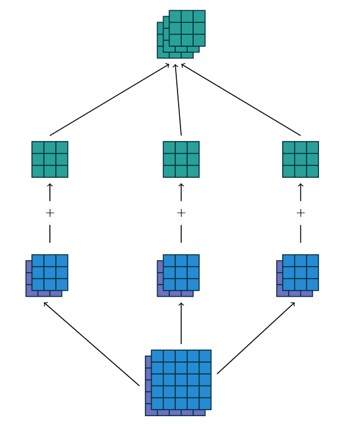
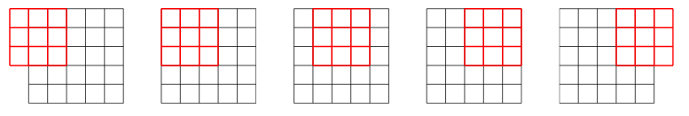

## 13 - CONVOLUTIONAL NEURAL NETWORKS

TODO: Pooling

### The magic of convolutions

One of the most powerful tools in ML is  feature engineering, which transforms the data by generating new features that make it easier to model.

In the context of an image, a feature is a visually distinctive attribute. For example, the number 7 is characterized by a horizontal edge near the top of the digit, and a top-right to bottom-left diagonal edge underneath that. So what if we could extract information about where the edges occur in each image, and then use that information as our features instead of raw pixels?

It turns out that finding the edges in an image is a very common task in computer vision and is surprisingly straightforward. To do it, we use something called a **convolution**. A convolution requires nothing more than **multiplication** and **addition**.

A convolution applies a **kernel** (i.e., filter) across an image. A kernel is a little matric such as the following:

```python
top_edge = torch.tensor([-1,-1,-1], 
						[0, 0, 0], 
						[1, 1, 1]).float()
```

This specific kernel would be interesting for detecting top horizontal edges in a figure (edges that go from light at the top to dark at the bottom). The application of a kernel (i.e., convolution operation) to an image is simple. It multiplies each element of the kernel by each element of a 3x3 block of the image. The results of thesemultiplications are then added together. For example:


Changing our kernel to have the row of 1s at the top and the -1s at the bottom would detect horizontal edges that go from dark at the top to light at the bottom. Additionally, putting the 1s and -1s in columns versus rows would give us filters that detect vertical edges. Each set of weights of the kernel will produce a different kind of outcome.

### Mapping a convolutional kernel

The application of a kernel over an image generates an output activation map, also known as an **output feature map**. If there are multiple input feature maps, the kernel will have to be 3-dimensional – or, equivalently each one of the feature maps will be convolved with a distinct kernel – and the resulting feature maps will be summed up elementwise to produce the output feature map.



In this example, we would have two input maps and three kernels.

### Strides and padding

When applying a kernel with 0 padding, the resulting output map will usually have a lower height and width than the original input map. The reason being that we are limiting the space this kernel can move thorugh the image (we do not allow it to go over the image limits):


A simple way to increase the size of the output map is to consider **padding**, which is simplyto add additional pixels around the outside of our image. Most commonly in the form of zeros. With appropriate padding, we can ensure that the output activation map is the same size as the original image, which can make things a lot simpler when we construct our architectures. The following image shows giw adding padding allows us to apply the kernel in the image corners:



If we add a kernel of sie `ks` by `ks` (with `ks` being an odd number), the necessary padding on each side to keep the same shape is `ks//2`. An even number for `ks` would require a diffeent amount of padding on the top/bottom and left/right, but in practice we almost never use an even kernel size.

Another aspect that affects the shape  of the output map is the **stride**, i.e., the distance between two consecutive positions of the kernel. Increasing the stride would also decrease the size of our outputs. We normally use stride-1 convolutions for adding layers without changing the output size, and we use stride-2 or more to decrease the size of our outputs.

The formula for estimating the size of each dimension in the output map is as follows (where `pad` is the padding, `ks` is the kernel dize, and `stride` is the stride):

`(n + 2*pad - ks) // stride + 1`

### Convolutions in PyTorch

Convolution is such an important and widely used operation that <a href="https://pytorch.org/docs/stable/generated/torch.nn.Conv2d.html">PyTorch has it built in</a>. 

#### Creating a Convolutional neural network in PyTorch

Manually establishing our own kernels is not feasible. Especially when we get deeper and deeper into the network, where convolutionalkernels become complex transformations of features from lower levels.

Instead, it would be best to learn the values of the kernels using an optimization method such as SGD. In effect, the model will learn the features that are useful for classification. When we use convolutions instead of (or in addition to) regular layers, we create a convolutional neural networks (CNN).

In order to create a CNN, we will use PyTorch module `nn.Conv2d`. It is very convenient because it automatically creates the kernel weight matrix when instantiating it.

As an example, lets consider the basic neural netowkr we had in Chapter 4 for the MNIST example:

```python

simple_nn = nn.Sequential(
			nn.Linear(28*28, 30),
			nn.ReLU(),
			nn.Linear(30,1)
)

```

We now want to create asimilar architecture but using convolutional layers instead of linear. Here is a possible architecture:

```python

broken_cnn = nn.Sequential(
	nn.Conv2d(1,30, kernel_size=3, padding=1)
	nn.ReLu(),
	nn.Conv2d(30,1, kernel_size=3, padding=1)
)

```

One thing to note here is that we did not need to specify `28*28` as the input size. That's because a linear layer needs a weight in the weight matrix for every pixel, so it needs to know how many pixels there are, but a **convolution is applied over each pixel automatically**. The kernel weights depend only on the number of input and output channels and, of course, the kernel size.

The problem with this architecture is the shape of the result:

```python

broken_cnn(xb).shape # xb has a batch size of 64

> toch.Size([64, 1, 28, 28])

```

This is not something we can use to do classification, since we need a single output activation per image, not a 28x28 map  of activations. One way to deal with this is to use enough stride-2 convolutions such that the final layer is size 1. After one stride-2 convolution, the size will be 14x14; after two, it will be 7x7; then 4x4, 2x2, and finally size 1.

We can use the following function to avoid inconsistencies in our defined architecture:

```python

def conv(ni, nf, ks=3, act=True):
	res=nn.Conv2d(ni, nf, stride=2, kernel_size=ks, padding=ks//2)
	if act: res= nn.Sequential(res, nn.ReLU())
	return res
```

When we use a stride-2 convolution, we often double the number of filters (i.e., kernels) to avoid changing the amount of computation in deeper layers. If we left the number of filters the same, the amount of computation done in the net would get less and less as it gets deeper. However, we know that the deeper layers have to compute semantically rich features, so we wouldn't expect that doing less computation would make sense.

Here is how we can build a simple CNN using previous function:

```python

simple_cnn = nn.Sequential(
		conv(1, 4), 	# 14x14
		conv(4, 8), 	# 7x7
		conv(8, 16), 	# 4x4
		conv(16, 32),	# 2x2
		conv(32, 1, act=False),	# 1x1
		Flatten()
)
```

The comments after each convolution allows us to show how large the activation map will be after each layer. Note, however, that these comments assume an input size of 28x28.


Note that the output of the final `Conv2d` layer  is 64 x 2 x 1 x 1. We need to remove those extra 1x1 axes; that is what `Flatten` does. It is basically the same as PyTorch's `squeeze` method, but as a module.

### Receptive fields

The *receptive field* is the area of an image that is involved in the calculation of a layer. This concept allows us to better understand why deeper convolutions require a higher number of filters to offset the reduced dimensionality of their corresponding output maps.

Let's consider a simple example from MNIST wtih two convolutional layers, each of stride-2 and with a kernel size of 3.

In this example, we can see that a 7x7 area of cells in the input layer is used to calculate a single green cell in the `Conv2` layer. This 7x7 area is the receptive field in the input of the green activation in `Conv2`.

As you can see from this example, the deeper we are in the network (specifically, the more stride-2 convolutions we have before a layer), the larger the receptive field  for an activation in that layer is. A large receptive field means that a large amount of the input image is used to calculate each activation in that layer. We now know that in the deeper layers of the network, we have semantically rich features, corresponding to larger receptive fields. Therefore, we'd expect that we'd need more weights for each of our features to handle this increasing complexity. This is another way of saying the same thing we metioned in the previous section: when we introduce a stride-2 convolution in our network, we should al so increase then number of filters (i.e., kernels).

