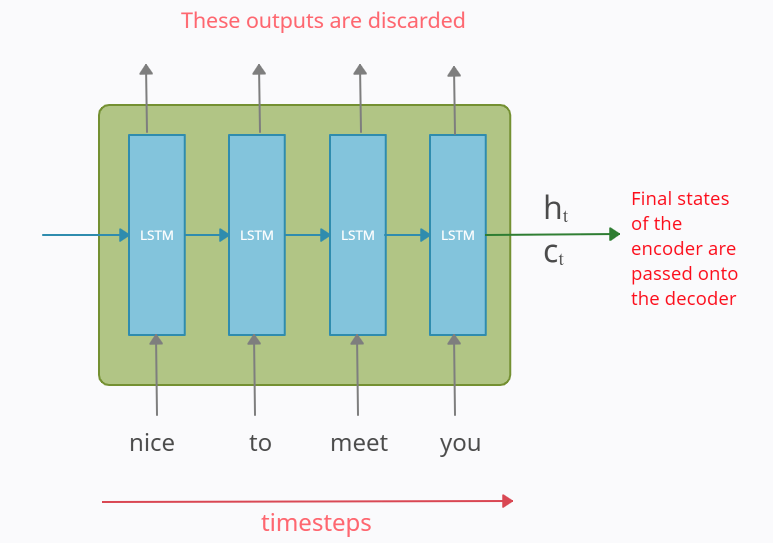
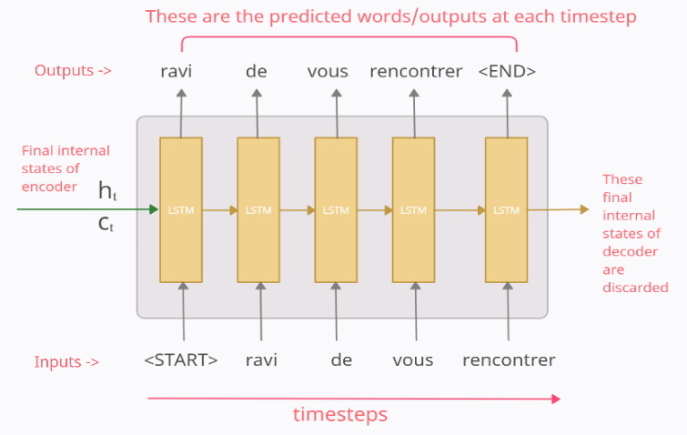
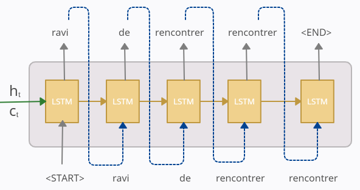
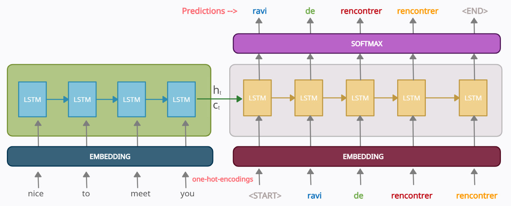
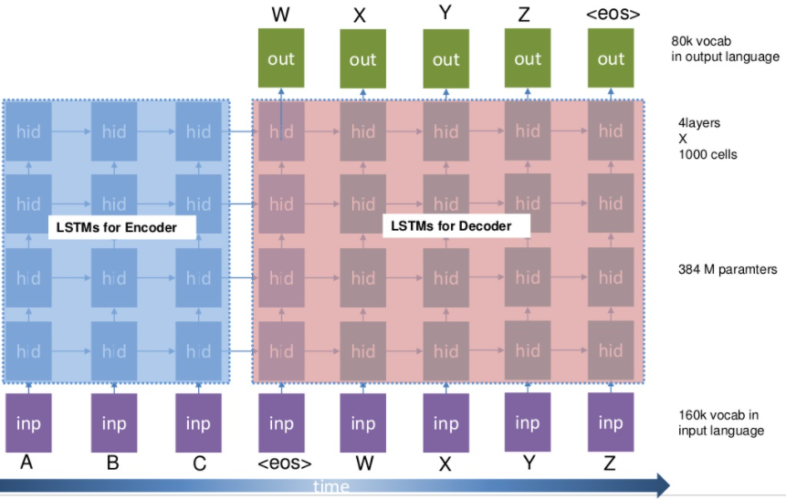
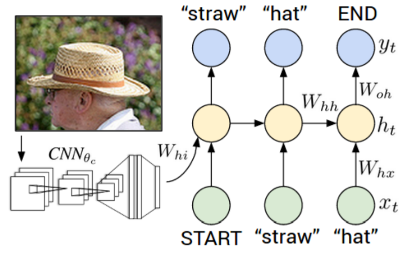

# Encoder-Decoder Seq2Seq Models, clearly explained

<a href="https://medium.com/analytics-vidhya/encoder-decoder-seq2seq-models-clearly-explained-c34186fbf49b">Original article</a>

## 1 - Introduction

Traditional deep neural netowkrs are powerful machine learning models that achieve excellent performance on difficult problems such as speech recognition and visual object recognition. But they can only be used for large labeled data where inputs and targets can be sensibly encoded with vectors of fixed dimensionality. They cannot be used to map sequences-to-sequences (e.g., **machine translation**). Sequences pose a challenge for DNNs because they require that the dimensionality of the inputs and outputs is known and fixed. 

### 1.1 - Sequence modelling problems

Sequence modelling problems refer to the problems where either the input and/or the output is a sequence of data (words, letters, etc.).

Consider a very simple problem of predicting whether a movie review is positive or negative. Here our input is a sequence of words and our output is a single number between 0 and 1. If we used traditional DNNs,we would typically have to encode our sequence of data into a numerical vector with fixed length using an embedding. But, we would lose the very important piece of information that is **word ordering**.

Sequence problems can be broadly classified into the following categories:

Each rectangle is a vector and arrows represent functions (e.g., matric multiplication). Input vectors are in red, output vectors are in blue and green vectors hold the RNN's state (more on this soon). From left to right:

1. Traditional DNN, from fixed-sized input to fixed-sized output.
2. Sequence output (e.g., image captioning takes an image and outputs a sentence of words).
3. Sequence input (e.g., text classification such as sentiment analysis)
4. Sequence input and output (e.g., machine translation: an RNN reads a sentence in English and then outputs a sentence in French).
5. Synced sequence input and output (e.g., video classification where we wish tolabel each frame of the video).

Notice than (2)-(5) there areno pre-specified constraints on the lengths sequences because the recurrent transformation (green) is fixed and can be applied as many times as we like.

### 1.2 - Sequence-to-sequence problems

We focus on Sequence-to-Sequence (Seq2Seq) problems, which are a special case of sequence modelling problems in which both the input and the ouput are sequences. Encoder-Decoder models were originally built to solve such Seq2Seq problems. In this article we will use machine translation (many-to-many seq2seq) as a running example. Later, we will also see how Seq2Seq models can also be used for image captioning (one-to-many seq2seq).

## 2 - The architecture of Encoder-Decoder models

**Note:** to help explain the architecure, we are going to consider the task of machine language translation from English to French. for simplcity, we are going to consider that our data consists of single sentnce:

* Input: "nice to meet you"
* Output: "ravi d vous recontrer"

### 2.1 - Overview

At a very high-level, an encoder-decoder model can be though of as two blocks, the encoder and the decoder connected by a vector which we will refer to as the "context vector".

* **Encoder**. The encoder processes each token in the input sequence. It tries to cram all the information about the input-sequence into a vector of fixed length (i.e., the context vector). After going through all the tokens, the encoder passes this vector onto the decoder.

* **Decoder**. The decoder reads the context vector and tries to  predict the target-sequence token by token.

The internal structure of both the blocks would look something like this:

As far as architecture is concerned, it's quite straightforward. The model can be thought of two gated recurrent unit (GRU) or two long-term short-term memory (LSTM) cells with some connection between them. The main thing is how we deal with the inputs and the outputs.

### 2.2 - The Encoder block

The encoder part is an LSTM/GRU cell. It is fed in the input-sequence over time and it tries to encapsulate all its information and store it in its final internal states hₜ (hidden state) and cₜ (cell state). The internal states are then passed onto the decoder part, which it will use to try to produce the target-sequence. This is the ‘context vector’ which we were earlier referring to.

**Note:** The outputs at each time-step of the encoder part are all discarded.

### 2.3 - The Decoder block

The decoder block is also a LSTM/GRU cell. Then main thing to note here is that the initial states `{h0, c0}` of the decoder are set to the final states `{ht, ct}` of the encoder. These act as the context vector and help the decoder produce the desired target-sequence.

The output at any time-step `t` is supposed to be the tth word in the true target-sequence (in our example, "ravi de vous rencontrer").

**Note:** The final internal state of the decoder is discarded.

## 3 - Training and testing

### 3.1 - Training and testing of encoder

The working of the encoder is the same in both the training and testing phase. It accepts each token/word of the input sequence one by one and sendsthe final states to the decoder.

### 3.2 - Training and testing of decoder

The working of the decoder is different during the training testing phase.

#### Training

To train our decoder model, we usually utilize a technique called **Teacher Forcing** in which we feed the **true** output/token (and not the **predicted** output/token) from the previous time-step as input to the current time-step.

As an example, consider the above diagram. In this example, the vector `[1 0 0 0 0 0]` for the word "<START>" is fed as the input vector. Now, ideally, our model should predict `y1_true = [0 1 0 0 0 0]`, but since my model has just started training,it will output something randome. Let the predicted value at time-step 1 be `y1_pred=[0.02 0.12 0.36 0.1 0.3 0.1]` meaning it predicts the 1st token to be "de". Now, should we use this y1_pred as the input at time-step 2?. We can do that, but in practice, it was seen that this leads to problems like slow convergence, model instability, and poor skill which is quite logical if you think. 

Thus, **teacher forcing** was introduced torectify this, by feeding the true output/token (and not the predicted output) from the previous time-step as input to the current time-step. That means the input to the time-step 2 will be `y1_true=[0 1 0 0 0 0]` and not `y1_pred`.

Similarly, at time-step 2, `y2_pred` will probably be some random vector. But at time-step 3 we will be using `y2_true = [0 0 1 0 0 0]` and not y2_pred. **At each time-step we will use the true output from the previous time-step.**

Finally, the loss iscalculated on the predicted outputsfromeach time-step and the errors are backpropagated through time to update the parameters of the model. The loss function is cross-entropy loss or negative-likelihood loss.

#### Testing

During testing we do not have y_true, so the predicted output from the previous time-step is fed as input to the current time-step. 

## 4 - Embedding layer

One little detail that was avoided in previous explanations of the encoder and decoder was that their input are passed through an embedding layer to reduce the dimensions of the input wordvectors because, in practice, one-hot-encoded vectors can be very large.

## 5 - The "Sutskever Model"

The work of <a href="https://arxiv.org/abs/1409.3215">Sutskever et al. [2014]</a> was one of the pioneers in introducing the encoder-decoder model for machine translation and in general for Seq2Seq modelling. In the paper, the authors considered a bigger model with:

* A 1000-dimensional word embedding layer to represent the input words.
* 4 layers of LSTM cells with 1000 units per layerin both the encoder and the decoder blocks.

## 6 - Extra: Image caption inutition using Seq2Seq

The work of <a href="https://arxiv.org/abs/1412.2306">Karpathy et al. [2014]</a> used a different version ofthe encoder-decoder model for image captioning, which is the process of generating a textual description of an image.

In their work, the image is fed into a convolutional neural network (CNN) and then the activations of the last dense layer are fed into the decoder's LSTM. This last CNN layer in some sense actas as a context vector as it captures the essence of the image.

## 7 - Next steps

If we want to improve our results, we need to pay <a href="https://jalammar.github.io/visualizing-neural-machine-translation-mechanics-of-seq2seq-models-with-attention/">**attention**</a>