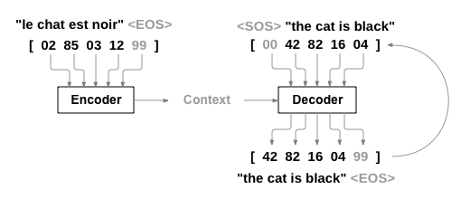

## 3 - TRANSFORMER ANATOMY

In this chapter,we'll first focus on building the attention mechanism, and then add the bits and pieces necessary to make a transformer encoder work. We'll also take a brief look at the architectural differences between the encoder and decoder modules.

This chapters also introduces a taxonomy of transformers to help you understand the zoo of models that have emerged in recent years.

### 3.1 - The Transformer architecture

The original Transformer is based on the encoder-decoder architecture that is widely used for tasks like machine translation, where a sequence of words is translated from one language to another. This architecture consists of two components:

* *Encoder*. Converts an input sequence of tokens into a sequence of embedding vectors and then compiles those vectors into others that are called the hidden state or context.
* *Decoder*. Uses the encoder's hidden state to iteratively generate an output sequence of tokens, one token at a time.

The Transformer architecture was originally designed for sequence-to-sequence tasks like machine translation, but both the encoder and decoder blocks were soon adapted as standalone models. Although there are hundreds of different transformer models, most of them belong to one of three types:

#### Encoder-only

These models convert an input sequence of text into a rich numerical representation that is well suited for tasks like text classification or named entity recognition. *BERT* and its variants, like *RoBERTa* and *DistilBERT*, belong to this class of architectures. The representation computed for a given token in this architecture depends both on the left (before the token) and the right (after the token) contexts. This is often called **bidirectional attention**.

#### Decoder-only

Given a prompt of text like "Thanks for lunch, I had a..." these models will auto-complete the sequence by iteratively predicting the most probable next word. The family of GPT models belong to this class. The representation computed for a given token in this architecture depends only on the left context. This is often called **causal** or **autoregressive attention**.

#### Encoder-decoder

These are used for modeling complex mappings from one sequence of text to another; they are suitable for machine translation and summarization tasks. In addition to the original Transformer architecture, the BASRT and T5 models belong to this class.

---

<mark>Note: </mark> In reality, the distinction between applications for decoder-only versus encoder-only architectures is a bit blurry. For example, decoder-only models like those in the GPT family can be primed for tasks like translation that are conventionally thought of as sequence-to-sequence tasks. Similarly, encoder-only models like BERT can be applied to summarization tasks that are usually associated with encoder-decoder or decoder-only models.

---

### 3.2 - The Encoder

The transformer's encoder usually consists of many encoder blocks stacked next to each other (encoder stack). Each encoder block receives a sequence of embeddings and feeds them through the following sublayers:

* A multi-head **self-attention layer**

* A fully connected **feed-forward layer** that is applied to each input embedding

The output embeddings of each encoder block have the same size as the inputs. We'll soon see that the main role of the encoder stack is to "update" the input embeddings to produce representations that encode some contextual information in the sequence. For example, the word "apple" will be updated to be more company-like and less "fruit-like"" if the words "keynote" or "phone" are close to it.

Each of these sublayers also uses skip connections and layer normalization, which are standard tricks to train deep neural networks effectively. But, to truly understand what makes a transformer work, we have to go deeper. Let's start with the most important building block: the **self-attention layer**.

##### 3.1.1 - Self-attention

Attention is a mechanism that allows neural networks to assign a different amount of weight or "attention" to each element in a sequence.

For text sequences, the elements are token embeddings, where each token is mapped to a vector of some fixed dimension. For example, in BERT, each token is represented as a 768-dimensional vector. 

----

<mark>Note: </mark>The "self" part in "self-attention", refers to the fact that these weights are computed for all hidden states in the same set; for example, all the hidden states of the encoder. By contrast, the attention mechanism associated with recurrent models involves computing the relevance of each encoder hidden state to the decoder hidden state at a given decoding timestep.

----

The main idea behind self-attention is that instead of using a **fixed** embedding for each token, we can use the whole sequence to compute a **weighted average** of each embedding. Another way to formulate this is to say that given a sequence of  token embeddings $\mathbf{x} = {x_{i},\dots, x_{n}}$ , self-attention produces a sequence if new embeddings $\mathbf{x}' ={x_{i}',\dots, x_{n}'}$ where each ${x_{j}'}$ is a linear combination of all the ${x_{j}'}$:

${x_{i}' = \sum_{j=1}^{n} w_{ji}x_{j}}$

The coefficients ${w_{ji}}$ are called attention weights and are normalized so that $\sum_{j} w_{ji}$.

To see why averaging the token embeddings might be a good  idea, consider what comes to mind when you see the word "flies". You might think of insects, but in other contexts such as "time flies like an arrow", then it would refer to a verb instead. We can create a representation for "flies" that incorporates this context by combining all the token embeddings in different proportions. For example, by assigning a larger weight $w_{ji}$ to the token embeddings of "time" and "arrow". Embeddings that are generated in this way are called **contextualized embeddings** and predate the invention of transformers in language models like ELMo ([Peters et al., 2017](https://arxiv.org/abs/1802.05365)). 

###### Scaled dot-product attention

There are several ways to implement a self-attention block, but the most common one is scaled dot-product attention, from the original Transformer article ([Vaswani et al., 2017](https://arxiv.org/abs/1706.03762)). There are four main steps required to implement this mechanism:

1. **Project each token embedding** into three vectors called *query* ($\mathbf{q}$), *key* ($\mathbf{k}$), and *value* ($\mathbf{v}$). Each of dimension $n$.

2. **Compute attention scores**. We determine how much the *query* and *key* vectors relate to each other using a *similarity function*. As the name suggests, the similarity function for scaled-dot product attention is the dot product, efficiently computed using matrix multiplication. Similar queries and keys will have a large dot product, while those that don't share much n common will have little to no overlap. The outputs from this step are called the attention scores. For a sequence with *n* input tokens, there is a corresponding $n \times n$ matrix of attention scores.

3. **Compute attention weights**. Dot products can in general produce arbitrarily large numbers, which can destabilize the training process. To handle this, the attention scores are first multiplied by a scaling factor to normalize their variance and then apply the softmax function to ensure all the column values sum to 1. The resulting $n \times n$ matrix corresponds to the attention weights.

4. **Update the token embeddings**. Once the attention weights are computed, we multiply them by the value vector $v_{1}, \dots, v_{n}$ to obtain an updated representation for embedding $x_{i}' = \sum_{j} w_{ji}$.
